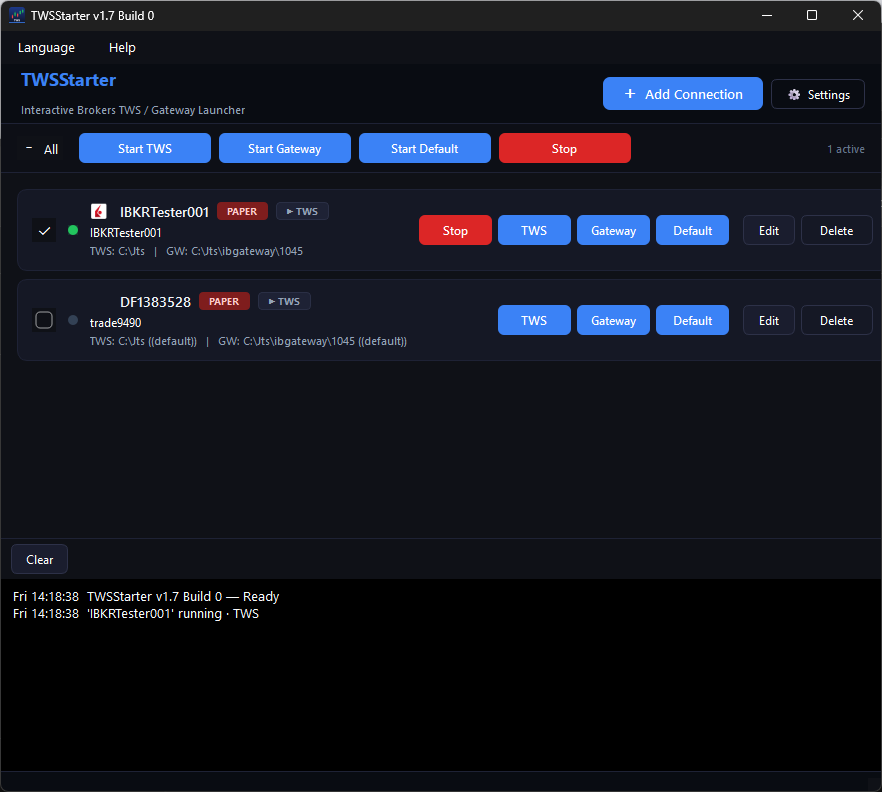

# TWSStarter

A small desktop **launcher for Interactive Brokers Trader WorkStation (TWS) and
IB Gateway**. It starts TWS or Gateway, fills in the login automatically,
monitors which connections are running, and lets you start or stop several at
once — including multiple installations or versions side by side.

TWSStarter *launches and reports status only*. It does **not** keep TWS/Gateway
running or restart them — for that, use TWS's own Auto Restart (see
[Keeping TWS/Gateway running](#keeping-twsgateway-running)).



## Features

- **One-click launch** of TWS or Gateway per connection, or as a batch over all
  ticked connections (Start Default / TWS / Gateway).
- **Automatic login** — username, password and the Live/Paper tab are filled in
  the TWS/Gateway login dialog. Detection is language-independent.
- **Encrypted credentials** — passwords are stored encrypted with a key bound to
  the local machine.
- **Runtime monitoring** — detects TWS (by window title) and Gateway (by its API
  port) system-wide, even instances started in an earlier session, and shows a
  live status per connection (stopped / starting / running).
- **10 languages** with national-flag menu icons: English, German, French,
  Spanish, Italian, Russian, Dutch, Portuguese, Simplified Chinese, Japanese.
- **Trace panel** and rotating file logs.

## Requirements

- **Python 3.13+**
- [`uv`](https://docs.astral.sh/uv/) for dependency management
- Dependencies (resolved by `uv`): PyQt6, cryptography, pyautogui, pywinauto
- **Platform:** the UI and launching work cross-platform, but **autofill and
  runtime monitoring are Windows-only** (they use the Win32 API). Prebuilt
  Windows and Linux binaries are provided.

## Getting started (from source)

```bash
uv sync                       # create the venv and install dependencies
uv run python -m twsstarter.main
```

On Windows you can also use [`run.bat`](run.bat).

## Building

Version and build number come from a single source of truth,
[`src/twsstarter/version.py`](src/twsstarter/version.py); the build scripts read
it so packages stay in sync.

- **Windows** — [`build/build_windows.bat`](build/build_windows.bat) produces
  `dist/TWSStarter.exe` and, if [Inno Setup 6](https://jrsoftware.org/isinfo.php)
  is installed, an installer under `build/installer_output/`. The app icon is
  regenerated with [`build/make_ico.py`](build/make_ico.py).
- **Linux** — [`build/build_linux.sh`](build/build_linux.sh) produces a single
  binary and a `.tar.gz` under `dist/`.

> When building for both platforms from the same working tree (e.g. Windows +
> WSL), give each its own virtualenv so they don't overwrite each other, e.g.
> `UV_PROJECT_ENVIRONMENT=.venv-linux` in WSL.

## Keeping TWS/Gateway running

TWSStarter does not restart anything. To keep TWS or Gateway up around the clock,
enable TWS's built-in **Auto Restart**: instead of the daily logoff it restarts
the app at a set time, so the session and API stay alive.

> TWS → **Configuration → Lock and Exit → Auto Logoff Timer** → set the restart
> time and select **Auto restart**.

## Configuration & data

Everything is stored per-user:

- `%LocalAppData%\TWSStarter\config.json` — settings and connections
- `%LocalAppData%\TWSStarter\log\` — rotating logs (kept 3 days)

## Security

Passwords are encrypted (Fernet / AES) with a key derived from a stable
per-machine identifier (the Windows *MachineGuid*). The config file therefore
**cannot be decrypted on a different machine** — if you move it, re-enter the
passwords. This is convenience-grade protection, not a substitute for OS-level
account security.

## Autofill tips

- Keep the login window visible and **do not move the mouse** while autofill runs.
- Autofill locates the login window by title and, for TWS, by its Java window
  class, so it works regardless of the TWS UI language.

## Project layout

```
src/twsstarter/
  main.py            entry point
  models.py          ConnectionEntry / AppSettings
  storage.py         config.json persistence (+ legacy migration)
  crypto.py          machine-bound credential encryption
  launcher.py        start TWS/Gateway + kick off autofill
  autofill.py        fill the login dialog (Windows)
  process_scan.py    system-wide TWS/Gateway detection (Windows)
  runtime_monitor.py background status tracking
  tracing.py         GUI trace feed + rotating file log
  paths.py           per-user data/log paths
  version.py         version/build single source of truth
  i18n/              translations (10 languages) + help
  resources/         app icon, flag icons, exe-icon extraction
  ui/                windows, dialogs, cards, theme
build/               PyInstaller spec, Inno Setup script, build scripts
```

## License

Released under the [MIT License](LICENSE) — © 2024–2026 trade-commander.de.

TWSStarter is an independent tool and is not affiliated with, endorsed by, or
connected to Interactive Brokers LLC. "Trader Workstation (TWS)", "IB Gateway"
and "IBKR" are trademarks of their respective owners.
